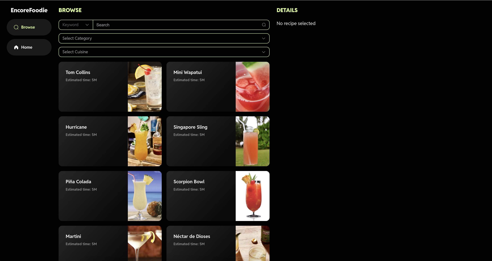
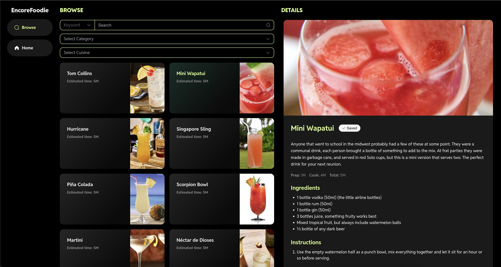
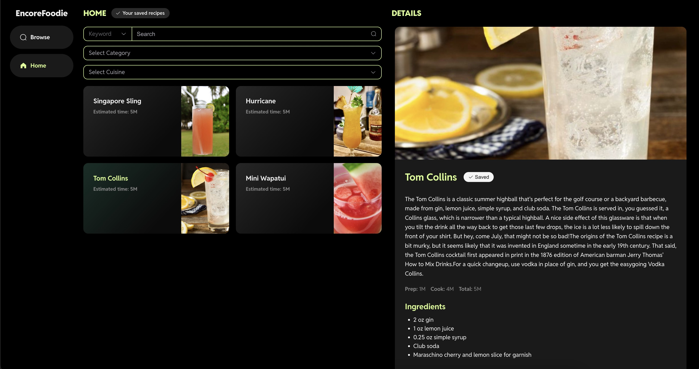
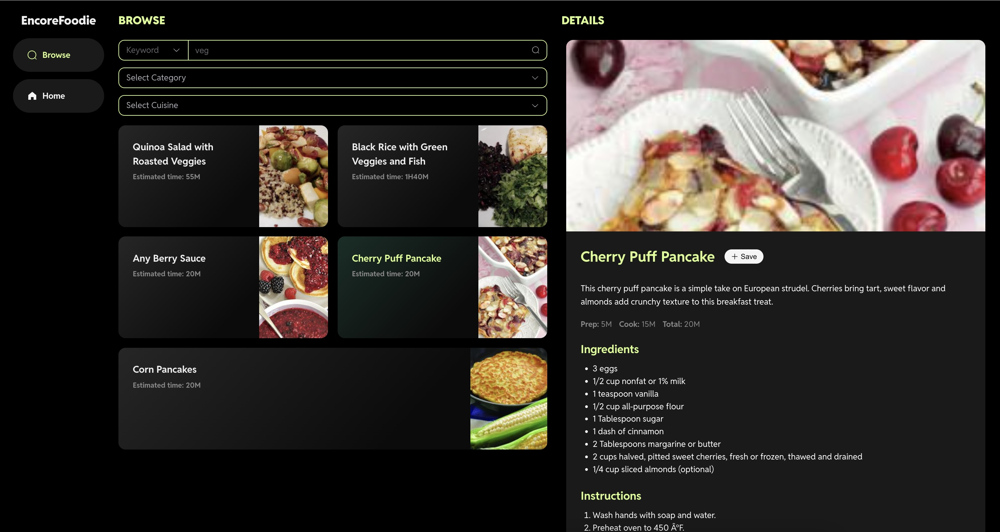
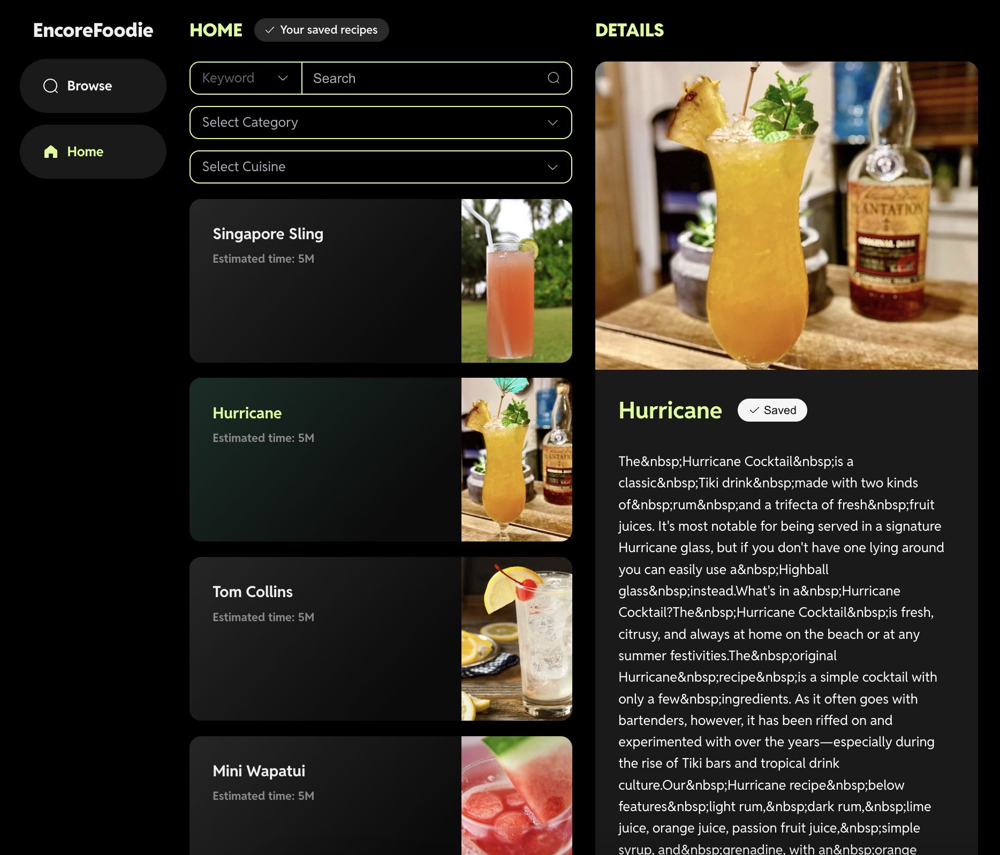
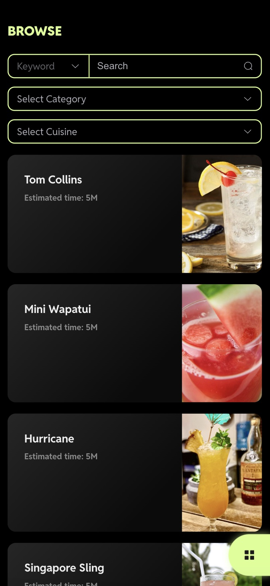
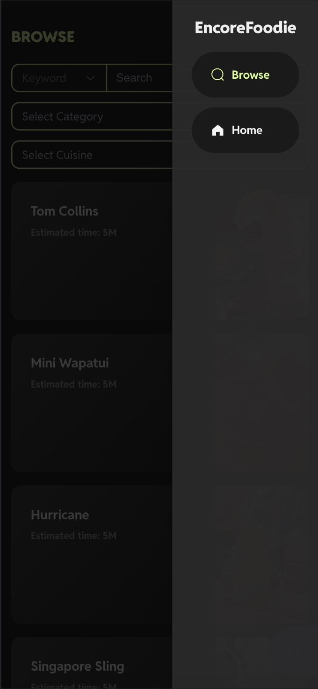
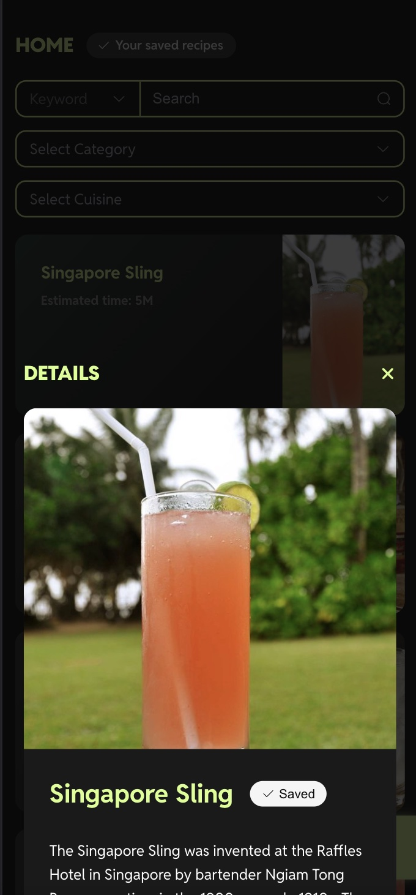
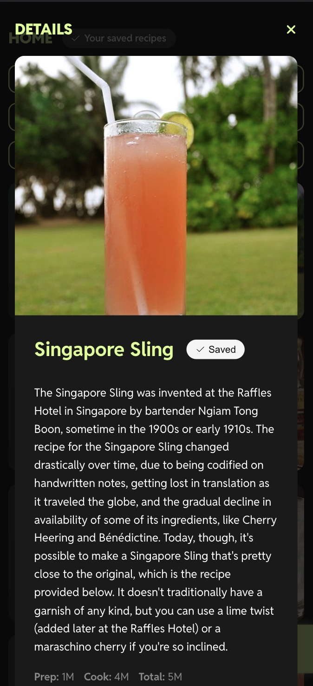

# Recipe App (EncoreFoodie)

Build using Vue 3 + TypeScript + Vite

## Screenshot (Desktop)

Browse

Recipe details

Home (Recipe saved to local)

Filter result

## Screenshot (Tablet)

Tablet responsive view

## Screenshot (Mobile)

  

  
Browse

    
  

  
Menu side bar

    
  

  
Detail slider from bottom (full screen scrollable)

    
    
  

